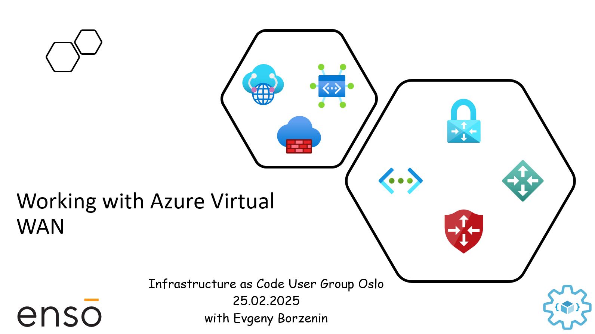

# Hub-spoke network topology with Azure Virtual WAN

This is level 200 workshop that covers different aspects of implementing Hub-spoke network topology with Azure Virtual WAN. You will learn:

- How to 
...

and much more...

Workshop is organized as a combination of theoretical blocks with slides and hand-on labs. Estimated time for workshop completion is between 3 and 4 hours.

## Agenda

- Welcome + practical information
- Hub-spoke network topology with Azure Virtual WAN (slides)
- [Lab-01](labs/lab-01/index.md) - Provision lab resources
- [Lab-08](labs/lab-08/index.md) - Cleaning up resources

## Prerequisites

Please spend some time before the workshop and make sure that you have installed/registered/configured all [prerequisites](./prerequisites.md).