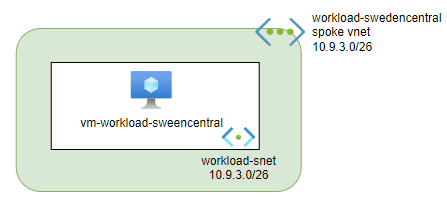

# Lab environment description

During the workshop we will be working with infrastructure that represents a typical use-cases that most of the companies are facing these days. Here are some facts about the lab environment:
- this is a hybrid environment with on-premises and cloud resources
- there are two on-premises "datacenters" located in Norway and Sweden
- we will be using NorwayEast and SwedenCentral as Azure regions
- there are two sets of workloads (On-prem and Cloud) deployed to NorwayEast and SwedenCentral
- on-prem and cloud workloads are implemented as Azure Virtual Machines (ubuntu)
- all infra resources are implemented in Bicep using Azure Verified Modules
- we use hub-spoke network topology using Azure Vitrual WAN
- we use two Azure Virtual Hubs, one at SwedenCentral and one at NorwayEast
- cloud workload Virtual Networks are connected to Azure Virtual WAN
- on-prem workloads are connected to Azure Virtual WAN as site-to-site (S2S) VPNs
- on-prem workloads VPN gateways are implemented as Azure VPN Gateway (no physical VPN devices)
- Azure Firewall is used to protect Azure VWAN Hubs for north-south and east-west traffic
- Azure VPN client is used to connect to both cloud and on-prem workloads
- `workload-norwayeast` can only communicate to `onprem-norwayeast`
- `workload-swedencentral` can communicate to `onprem-swedencentral`, `workload-norwayeast`, `workload-norwayeast` and `onprem-norwayeast`
- `onprem-swedencentral` can only communicate to `workload-swedencentral`
- Users should be able to access all workloads (both on-prem and cloud) at all regions using Azure VPN client

## Cloud Workload description 

## On-prem Workload description

An imaginary "on-prem workload" consists of:
 - Virtual Network called `vnet-onprem-<region>-1`
 - one ubuntu Virtual Machine called `vm-dc-<region>`

To be able to connect "on-prem workload" to the Virtual WAN Hub using Site-to-Site VPN, we use "standard" set of VPN Ganteway resources:
 - Virtual Network Gateway called `vpn-onprem-<region>-1`
 - Public IP (used by Virtual Network Gateway) called `pip-onprem-gw-<region>-1`
 - Local Network Gateway called  `lgw-onprem-<region>-1`
 - Connection called `onprem-<region>-to-hub`

 

## IP ranges

All IP ranges used in this lab defined in [IP ranges](https://github.com/Infrastructure-AsCode/hub-spoke-vwan/blob/main/iac/.global/variables.bicep) variables file.

## Before workshop start state

The initial state of the environment will be as follows:

- `workload-norwayeast` Virtual Network will be connected to NorwayEast Virtual Hub
- `onprem-norwayeast` datacenter will be connected to NorwayEast Virtual Hub using S2S VPN
- `workload-swedencentral` and `onprem-swedencentral` will not be connected to the Hub (yet)

## After workshop state

The final state of the environment will be as follows:

- `workload-swedencentral` Virtual Network will be connected to SwedenCentral Virtual Hub
- `onprem-sweencentral` datacenter will be connected to SwedenCentral Virtual Hub using S2S VPN
- both hubs will be secured using Azure Firewall
- Azure Firewall rules will be implemented to support network filtering requirements
