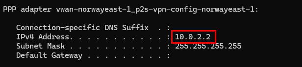

# lab-01 - provisioning of lab resources

As always, we need to provision lab environment before we can start working on the lab tasks. 

Infrastructure for Lab environment is implemented using `Bicep` and code is located under [iac](https://github.com/Infrastructure-AsCode/hub-spoke-vwan/tree/main/iac) folder. Most of the resources are implemented using [Azure Verified Modules](https://azure.github.io/Azure-Verified-Modules/indexes/bicep/bicep-resource-modules/). The master orchestration Bicep file is [main.bicep](https://github.com/Infrastructure-AsCode/hub-spoke-vwan/blob/main/iac/main.bicep). It orchestrates deployment of the following resources:


## Task #1 - Register required resource providers

Before we deploy lab resources, we need to register required resource providers. This is a one time operation (per subscription).

```powershell
az provider register --namespace Microsoft.Network
az provider register --namespace microsoft.insights
az provider register --namespace Microsoft.Compute
az feature register --name EncryptionAtHost --namespace Microsoft.Compute
az provider register --namespace Microsoft.Compute
```

## Task #2 - Authorize the Azure VPN application (if you haven't done it before)

1. Sign in to the Azure portal as a user that is assigned the `Global administrator` role.
2. Grant admin consent for your organization. This allows the Azure VPN application to sign in and read user profiles. Copy and paste the URL that pertains to your deployment location in the address bar of your browser:

```txt
https://login.microsoftonline.com/common/oauth2/authorize?client_id=41b23e61-6c1e-4545-b367-cd054e0ed4b4&response_type=code&redirect_uri=https://portal.azure.com&nonce=1234&prompt=admin_consent
```


3. Select the account that has the `Global administrator` role if prompted.
4. On the `Permissions requested` page, select `Accept`.

!!! info "Note"
    Some participants reported that they got the following error message:

    `AADSTS500200: User account ... is a personal Microsoft account. Personal Microsoft accounts are not supported for this application unless explicitly invited to an organization. Try signing out and signing back in with an organizational account."`    

In that case try following:

- create new Azure AD user
- assign it with `Global Administrator` role
- sign in with this new user into Azure portal (that may require to change the password)
- use this user to Authorize the Azure VPN application

## Task #3 - deploy lab resources

Now, let's deploy lab resources.

First, clone the repo. If you use SSH, use the following command:

```powershell
git clone git@github.com:Infrastructure-AsCode/hub-spoke-vwan.git
```

If you use HTTPS, use the following command:

```powershell
git clone https://github.com/Infrastructure-AsCode/hub-spoke-vwan.git
```

```powershell
# change directory to iac folder
cd .\hub-spoke-vwan\iac\

# Deploy Bicep master template
.\deploy.ps1
```

!!! info "Estimated deployment time"
    Because of Azure Virtual Network Gateway and Azure VWAN with both S2S and P2S Gateways, deployment takes approx. 60 minutes.

## Task #4 - configure Azure VPN client

Check that Azure VPN client is installed on your machine. If not, download and install it from [here](https://www.microsoft.com/en-us/p/azure-vpn-client/9np355qt2sqb?activetab=pivot:overviewtab), or use `winget` (only for Windows users):

```powershell
winget install "azure vpn client"
```

Next, from Azure portal, download client profile configuration file. Go to your Azure VWAN resource at `rg-vwan-labs-norwayeast-1 -> vwan-norwayeast-1 -> User VPN configurations -> p2s-vpn-config-norwayeast-1` and click on `Download virtual WAN user VPN profile` file.


Select `EATPLS` as Authentication type and click `Generate and download profile`.


Extract `p2s-vpn-config-norwayeast-1.zip` archive. It contains two folder:


Start Azure Vpn client and import `azurevpnconfig.xml` file from `AzureVPN` folder. It will create new VPN connection profile. 


When `azurevpnconfig.xml` file is loaded, click `Save`.


You will now see new VPN connection profile in Azure VPN client and you can connect to it.


You will be asked to enter your Azure AD credentials and if everything is configured correctly, you will be connected to your Azure lab environment. Note, you will only need to provide your Azure AD credentials when you connect to VPN for the first time. Next time you will be connected automatically.


Under the `Connection properties` you can find what is your VPN IP Address and what VPN routes are available. You will get the same VPN IP Address if you run `ipconfig` command in your terminal.

```powershell
ipconfig
```



## Task #5 - test connectivity to vm-dc-norwayeast and vm-wl-norwayeast Virtual Machines

Get `vm-dc-norwayeast` private IP address 

```powershell
az vm list-ip-addresses -g rg-vwan-labs-norwayeast-1 -n vm-dc-norwayeast --query  [0].virtualMachine.network.privateIpAddresses[0] -o tsv
```

Most likely it will be `10.1.0.132`, but you may have different IP address.

Make sure that Azure VPN is connected, use this IP and connect to `vm-dc-norwayeast` using SSH. Use `iac-user` as username and `fooBar123!` as a password (if you haven't change it during deployment).

```powershell
# use private IP from the previous command
ssh iac-user@10.1.0.132
```


You should now be able to SSH into `vm-dc-norwayeast`.

Get `vm-wl-norwayeast` private IP address 

```powershell
az vm list-ip-addresses -g rg-vwan-labs-norwayeast-1 -n vm-wl-norwayeast --query  [0].virtualMachine.network.privateIpAddresses[0] -o tsv
```

Most likely it will be `10.9.2.4`, but you may have different IP address.

Make sure that Azure VPN is connected, use this IP and connect to `vm-wl-norwayeast` using SSH. Use `iac-user` as username and `fooBar123!` as a password (if you haven't change it during deployment).

```powershell
# use private IP from the previous command
ssh iac-user@10.9.2.4
```


You should now be able to SSH into `vm-dc-norwayeast`.


## Task #6 - test connectivity to vm-dc-swedencentral and vm-wl-swedencentral Virtual Machines

Do the same exercise for `vm-dc-swedencentral` and `vm-wl-swedencentral` VMs.

```powershell
# get vm-dc-swedencentral private IP
az vm list-ip-addresses -g rg-vwan-labs-norwayeast-1 -n vm-dc-swedencentral --query  [0].virtualMachine.network.privateIpAddresses[0] -o tsv

# ssh to vm-dc-swedencentral
ssh iac-user@10.2.0.132

# get vm-wl-swedencentral private IP
az vm list-ip-addresses -g rg-vwan-labs-norwayeast-1 -n vm-wl-swedencentral --query  [0].virtualMachine.network.privateIpAddresses[0] -o tsv

# ssh to vm-wl-swedencentral
ssh iac-user@10.9.3.4
```

You should not be able to connect to `vm-dc-swedencentral` and `vm-wl-swedencentral` VMs.


