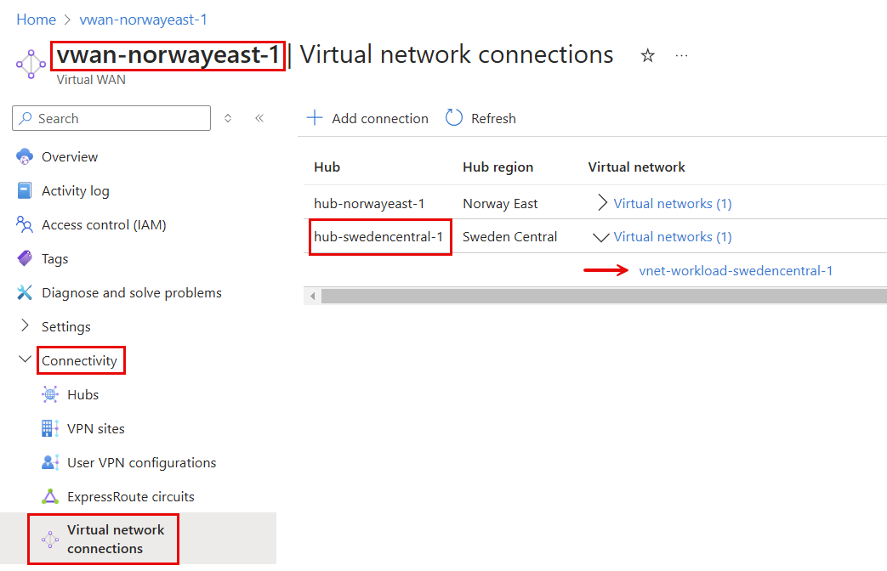

# lab-02 - connecting Sweden Central workload spoke Virtual Network to the SwedenCentral hub

In this lab, you will learn how to connect spoke Virtual Network to the Azure VWan hub. Since workload is located in SwedenCentral, we will connect it to the SwedenCentral hub.

## Task #1 - connect `vnet-workload-swedencentral-1` Virtual Network to `hub-swedencentral-1` hub

Navigato to `rg-vwan-labs-norwayeast-1 -> vwan-norwayeast-1 -> Settings -> Virtual network connections` and click on `+ Add connection` button. 


Fill in the form with the following values:

| Field | Value |
| --- | --- |
| Connection name | vnet-workload-swedencentral-1 |
| Hubs | Select `hub-swedencentral-1` from the list |
| Subscription | Select Subscription where you VWAn is deployed |
| Resource group | Select `rg-vwan-labs-norwayeast-1` |
| Virtual network | Select `vnet-workload-swedencentral-1` |
| Associate Route Table | Select `Default` |


Keep the rest of the values as default and click `Create` button. 

!!! info "Note"
    It might take up to 5 minutes for the connection to be established.


When the connection is created, you should see it in the list of Virtual network connections.



## Task #2 - test connectivity to `vm-wl-swedencentral` Virtual Machines

```powershell
# Get vm-wl-swedencentral private IP address 
az vm list-ip-addresses -g rg-vwan-labs-norwayeast-1 -n vm-wl-swedencentral --query  [0].virtualMachine.network.privateIpAddresses[0] -o tsv

# use private IP from the previous command
ssh iac-user@10.9.3.4
```


You may still experience no connection. Check Azure VPN client `VPN Routes` at `Connection Properties` page. As you can see there is no route to `10.9.3.0/26` IP range. This is because Azure VPN client haven't received newly linked VNet route(s) from the VWan hub yet. Reconnect (click Disconnect and Connect) your VPN client and check VPN routes again. You should now see `10.9.3.0/26` route in the list.


	
Try to SSH to `vm-wl-swedencentral` using `iac-user` / `fooBar123!` again.

```powershell
# ssh to vm-wl-swedencentral
ssh iac-user@10.9.3.4
```

You should now be able to SSH into `vm-dc-swedencentral`.

## Task #3 - test connectivity between `vm-wl-swedencentral`, `vm-wl-norwayeast` and `vm-dc-norwayeast` Virtual Machines

As always, use username `iac-user` and password `fooBar123!` to connect to all Virtual Machines (unless you changed these values during  deployment task).

````powershell
# Get vm-wl-norwayeast private IP address
az vm list-ip-addresses -g rg-vwan-labs-norwayeast-1 -n vm-wl-norwayeast --query  [0].virtualMachine.network.privateIpAddresses[0] -o tsv

# Get vm-dc-norwayeast private IP address
az vm list-ip-addresses -g rg-vwan-labs-norwayeast-1 -n vm-dc-norwayeast --query  [0].virtualMachine.network.privateIpAddresses[0] -o tsv

# Get vm-wl-swedencentral private IP address
az vm list-ip-addresses -g rg-vwan-labs-norwayeast-1 -n vm-wl-swedencentral --query  [0].virtualMachine.network.privateIpAddresses[0] -o tsv

# ssh to vm-wl-swedencentral
ssh iac-user@10.9.3.4

# from within vm-wl-swedencentral Virtual MAchine ssh to vm-dc-norwayeast
ssh iac-user@10.1.0.132

# exit from vm-wl-norwayeast back to vm-wl-swedencentral
exit

# from within vm-wl-swedencentral Virtual MAchine ssh to vm-wl-norwayeast
ssh iac-user@10.9.2.4

# exit from vm-wl-norwayeast back to vm-wl-swedencentral
exit

# exit from vm-wl-swedencentral
exit
````

You should now be able to connect from `vm-wl-swedencentral` to `vm-dc-norwayeast` and `vm-wl-norwayeast` Virtual Machines. 