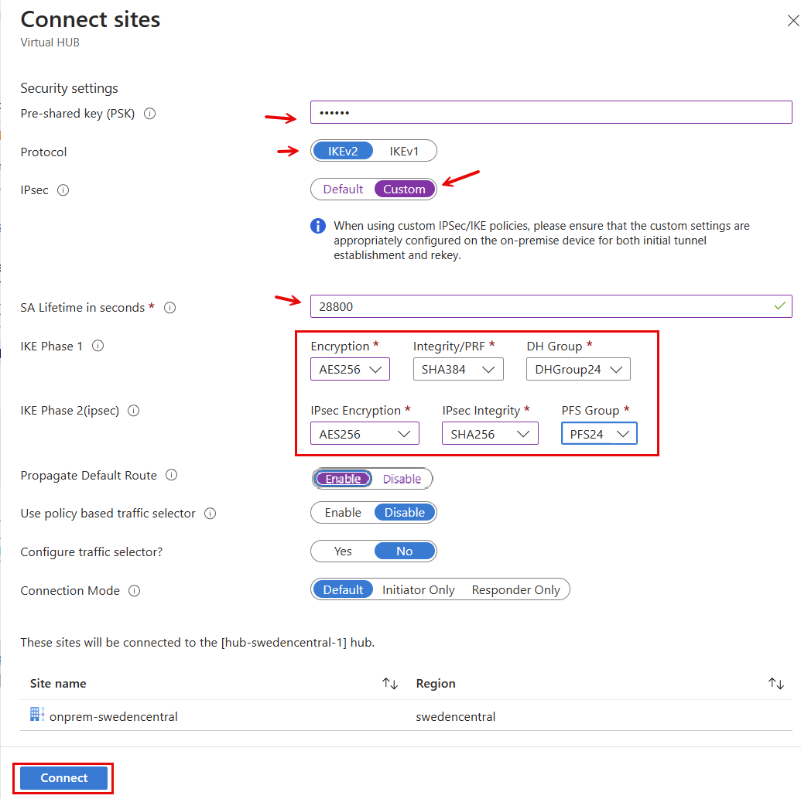
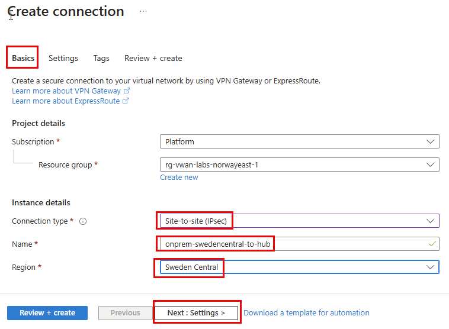

# lab-03 - create new site-to-site (S2S) VPN connection to imaginary SwedenCentral "on-prem environment"

In this lab, we use an imaginary "on-prem environment" which is deployed in Azure SwedenCentral region and consists of:
 - Virtual Network called `vnet-onprem-swedencentral-1` with IP range `10.2.0.0/24`
 - one ubuntu Virtual Machine called `vm-dc-swedencentral`
 
 

To be able to connect this "on-prem environment" to the VWAN Hub using S2S VPN, we already pre-provisioned "standard" set of VPN Ganteway resources:
 - Virtual Network Gateway `vpn-onprem-swedencentral-1`
 - Local Network Gateway `lgw-onprem-swedencentral-1`


## Task #1 - create a site in a virtual WAN

In this section, you create a site. Sites correspond to your physical locations. 

Navigate to your `rg-vwan-labs-norwayeast-1 -> vwan-norwayeast-1 -> Connectivity -> VPN sites` and click `+ Create site`.


On the `Basics` tab, complete the following fields:

| Field | Value |
|-------|-------|
| Resource group | Select `rg-vwan-labs-norwayeast-1` |
| Region | Select `Sweden Central` |  
| Name | Enter `onprem-swedencentral` |
| Device vendor | Type `Azure` |
| Private address space | Type `10.2.0.128/25` |


Click `Next: Links >` to continue. 

To configure VPN link, we need to find Public IP, BGP ASN and BGP address of the `vpn-onprem-swedencentral-1` Virtual Network Gateway.

````powershell
# Get Public IP of the pip-onprem-gw-swedencentral-1 used by vpn-onprem-swedencentral-1 Virtual Network Gateway
az network public-ip show --resource-group rg-vwan-labs-norwayeast-1 --name pip-onprem-gw-swedencentral-1 --query ipAddress -otsv

# Get BGP ASN of the vpn-onprem-swedencentral-1 Virtual Network Gateway
az network vnet-gateway show --resource-group rg-vwan-labs-norwayeast-1 --name vpn-onprem-swedencentral-1 --query bgpSettings.asn -otsv

# Get BGP address of the vpn-onprem-swedencentral-1 Virtual Network Gateway
az network vnet-gateway show --resource-group rg-vwan-labs-norwayeast-1 --name vpn-onprem-swedencentral-1 --query bgpSettings.bgpPeeringAddress -otsv
````

At the `Links` tab, complete the following fields (use values from the above commands):

| Field | Value |
|-------|-------|
| Link name | Enter `onprem-swedencentral` |
| Link speed | Set to 0 |
| Link provider name | Enter `Azure` |
| Link IP address / FQDN | Enter Public IP of `pip-onprem-gw-swedencentral-1`  |
| Link BGP address | Enter BGP Address of `vpn-onprem-swedencentral-1` |
| Link ASN | Enter BGP ASN of `vpn-onprem-swedencentral-1` |


Click `Next: Review + create >` and then `Create` to create the site.

After Site and Link are created, go back to `rg-vwan-labs-norwayeast-1 -> vwan-norwayeast-1 -> Connectivity -> VPN sites` and you should see new site was created, but not yet connected.


## Task #2 - connect the VPN site to a virtual hub

In this section, you connect `onprem-swedencentral` VPN site to the `hub-swedencentral` virtual hub.

On your Virtual WAN page, go to Hubs.
On the Hubs page, click `onprem-swedencentral` hub and  navigate to `Connectivity -> VPN (Site to site)` on the left pane.

On the VPN (Site to site) page, you should see `onprem-swedencentral` site. If you don't, you might need to clear `Hub association: Connected` filter.


Select the checkbox next to `onprem-swedencentral` site (don't click the site name directly), then click Connect VPN sites.


On the `Connect sites` page, configure the following settings:

| Field | Value |
|-------|-------|
| Pre-shared key (PSK): | Enter `foobar` |
| Protocol: | Select `IKEv2` |
| IPsec: | Select `Custom` |
| SA Lifetime in seconds | Enter `28800` |
| IKE Phase 1 |
| Encryption | Select `AES256` |
| Integrity/PRF | Select `SHA384` |
| DH Group | Select `DHGroup24` |
| KE Phase 2(ipsec) |
| IPsec Encryption | Select `AES256` |
| IPsec Integrity | Select `SHA256` |
| PFS Group | Select `PFS24` |

| Propagate Default Route | Select `Disable` |
| Use policy based traffic selector | Select `Disable` |
| Configure traffic selector | Select `No` |  
| Connection mode | Select `Default` |



Clieck `Connect` to create the connection. 

!!! info "Note"
    It might take up to 30 minutes for the connection to be established. You don't need to wait and can proceed to the next Task. 


## Task #3 - create VPN connections 

In real life, when you create a new VPN site, you need to configure VPN connections on your on-prem VPN device. In this lab, we will simulate this by creating a new VPN connection on the `hub-swedencentral` Virtual Network Gateway.

Navigate to `rg-vwan-labs-norwayeast-1 -> lgw-onprem-swedencentral-1 -> Settings -> Connections` and click `+ Add`.


At the `Basic` tab, complete the following fields:

| Field | Value |
|-------|-------|
| Resource group | Select `rg-vwan-labs-norwayeast-1` |
| Connection type | Select `Site-to-site (IPsec)` |
| Name | Enter `onprem-swedencentral-to-hub` |
| Region | Select `Sweden Central` |



Click `Next: Settings >` to continue.

At the `Settings` tab, complete the following fields:

| Field | Value |
|-------|-------|
| Virtual network gateway | Select `vpn-onprem-swedencentral-1` |
| Local network gateway | Select `lgw-onprem-swedencentral-1` |
| Authentication method | Select `Shared Key(PSK)` |
| Shared key(PSK) | Enter `foobar` |
| IKE protocol | Select `IKEv2` |
| Enable BGP | Set checkbox to ON |
| IPsec / IKE Policy | Select `Custom` |
| IKE Phase 1 |
| Encryption | Select `AES256` |
| Integrity/PRF | Select `SHA384` |
| DH Group | Select `DHGroup24` |
| KE Phase 2(ipsec) |
| IPsec Encryption | Select `AES256` |
| IPsec Integrity | Select `SHA256` |
| PFS Group | Select `PFS24` |
| IPsec SA lifetime in seconds | Enter `28800` |
| Use policy based traffic selector | Select `Disable` |
| Connection mode | Select `Default` |


Click `Review + create` and then `Create` to create the connection.

## Task #4 - test connectivity to `vm-dc-swedencentral` Virtual Machine

Because of some delays in logs processing into Log Analytics, it might take some time to show the status of new connection. Navigate to `rg-vwan-labs-norwayeast-1 -> vwan-norwayeast-1 -> Monitor -> Insights`. Depending on how lucky you are, you might see that your S2S VPN is up and running.


Reconnect your Azure VPN client and check that `10.2.0.128/25` IP range is present in VPN Routes list.


Now, let's try to connect to SSH into `vm-dc-swedencentral` using `iac-user` as username and `fooBar123!` as a password.

```powershell
# Get private IP of the vm-dc-swedencentral Virtual Machine
az vm list-ip-addresses -g rg-vwan-labs-norwayeast-1 -n vm-dc-swedencentral --query  [0].virtualMachine.network.privateIpAddresses[0] -o tsv
```

```powershell
# use private IP from the previous command
ssh iac-user@10.2.0.132
```

You should now be able to SSH into `vm-dc-norwayeast`.
